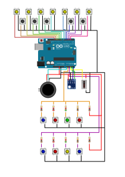

# Arduino Midi Wind Controller 
<a href="README.md">Español</a>   
This is the code and Assets for building a DIY Midi Wind Controller.  
My goal was to make a cheap controller with better dynamics than a midi keyboard to play trumpets, sax,flutes, and another wind instruments. 
It's built with 3D printed parts, spare parts from broken videogame controllers and USB devices and a sensor. 

These are the controller's features:

* 12 buttons to select which notes are playing.  
* 1 GY-68 BMP180 pressure sensor to detect blowing.
* 1 Joystick from an old GameCube Controller used as pitch / modulation wheel.
* 1 linear pot from an old GameCube Controller to control attack with bite pressure.
* 8 buttons for configuration / calibration of the device.

The picture below shows the wiring diagram of the device:

To use the device as a normal MIDI USB device it's necesary to flash  <a target="_blank" href="https://github.com/ddiakopoulos/hiduino">Hiduino</a> firmware or similar.   

To test and program the device before flashing the firmware, i've used <a target="_blank" href="https://projectgus.github.io/hairless-midiserial/">Hairless Midi</a>, note that for using the device via a Serial Port you must use a different baudrate than when you use it as a USB MIDI. This will be explained in assembly instructions.
Para realizar pruebas hasta reprogramar la placa de Arduino como dispositivo MIDI he utilizado <a target="_blank" href="https://projectgus.github.io/hairless-midiserial/">Hairless Midi</a>, ten en cuenta que la tasa de Baudios del dispositivo MIDI es distinta si lo utilizamos con esta aplicación.
All the 3D parts and drawings are made with<a target="_blank" href="https://www.freecadweb.org/">FreeCAD</a>  

Some parts are too big for my 3D printer, so i've printed them cutted in smaller parts. I've joined them using a soldering iron.  

I've printed the parts in PETG, but most of them should be fine in any material. The "reed" (part nº14) that detects bite pressure must be printed in a strong plastic (ABS or PETG should be fine). 

You can view the parts drawings <a href="Plano.pdf">here</a>.   

Also you have <a href="Parts/Stl">STL files for 3D printing</a> and <a href="Parts/FreeCAD">and FreeCAD files to modify.</a> 

The complete part list is:

* Arduino Uno or compatible board. (You have to make sure you can flash the USB chip to use as a MIDI device or you only will be able to use it as a serial MIDI device).
* 12 switches buttons for Arduino.   
* 1 Joystick (We will only be using one axis so you can use any rotatory potentiometer with a self returning mechanism).
* 1 slider pot (I use the one from a broken GameCube pad trigger, but then it broke and i have to replace it with a A20K pot with a similar size).   
* 1 spring for making the slider pot self-returning.
* 4 1k resistors, 2 of 2k, 2 of 5.1k y 2 of 10k. You can use other values. <a href="Doc/Resistors.md">Here you got a description of their function</a>.   
* 1 GY-68 BMP180 sensor.
* JST conectors to organize wires.
* Conectores JST para organizar los cables de manera más sencilla.
* 3D printed parts from above.
  

  